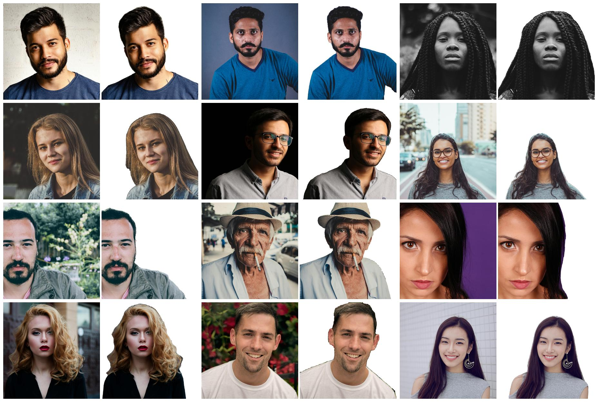
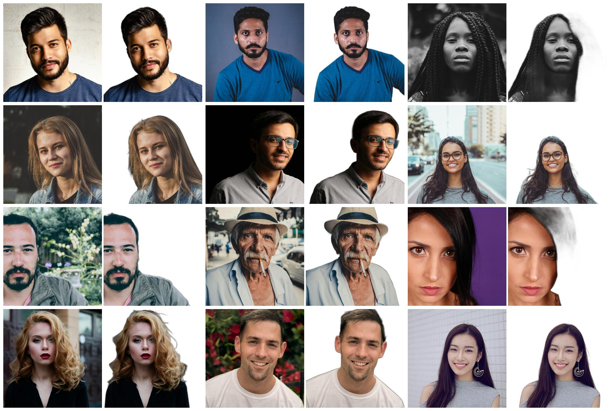

# Remback

A Python package for removing backgrounds from profile pictures using a fine-tuned Segment Anything Model (SAM).

## Installation
`pip install remback`

## Usage

### Command-Line Interface (CLI)

Remove the background from an image:

```bash
remback --image_path /path/to/input.jpg --output_path /path/to/output.jpg
```

`--image_path`: Path to the input image (required).
`--output_path`: Path to save the output image (default: output.jpg).

### Python API

Use it in your Python scripts:

```python
from remback.remover import BackgroundRemover

remover = BackgroundRemover()
remover.remove_background("input.jpg", "output.jpg")
```

## Fine-Tuning Details

Remback uses SAM for face-specific background removal through fine-tuning:

* Model Architecture: The last two blocks of SAM's image encoder were unfrozen, along with the prompt encoder and mask decoder, specifically for face segmentation

* Loss Functions: A combination of binary cross-entropy (35%), Dice loss (35%), and a custom BoundaryLoss (30%) were used to balance overall mask accuracy and edge precision

* Training Process: Trained with the AdamW optimizer, mixed precision, and early stopping based on validation mIoU.

## Post-Processing

The raw segmentation mask is refined through:

* Morphological operations to remove noise.

* Guided filtering for edge alignment.

* Distance transform and feathering for smoother alpha mask (although still can be improved more).

## Comparison to Other Tools

Unlike general-purpose tools like rembg, Remback is optimized for images with faces:

1. Uses `MTCNN` for face detection to guide segmentation.
2. Employs custom `BoundaryLoss` for sharper edges around complex areas like stray hair etc.

### Requirements

Python 3.8+
Dependencies (installed automatically): torch, opencv-python, numpy, mtcnn, segment-anything.

## Benchmark Results

### Remback 



### Rembg



We tested Remback against other methods. Here’s the table with mIoU and Accuracy (higher is better lah):

| Method          | mIoU   | Accuracy |
|-----------------|--------|----------|
| Remback         | 0.9584 | 0.9696   |
| Original SAM    | 0.3864 | 0.5757   |
| MTCNN           | 0.3164 | 0.4730   |
| Rembg           | 0.8468 | 0.8841   |

### Notes

The fine-tuned model is included in the package.
If no face is detected, it will raise an error.

